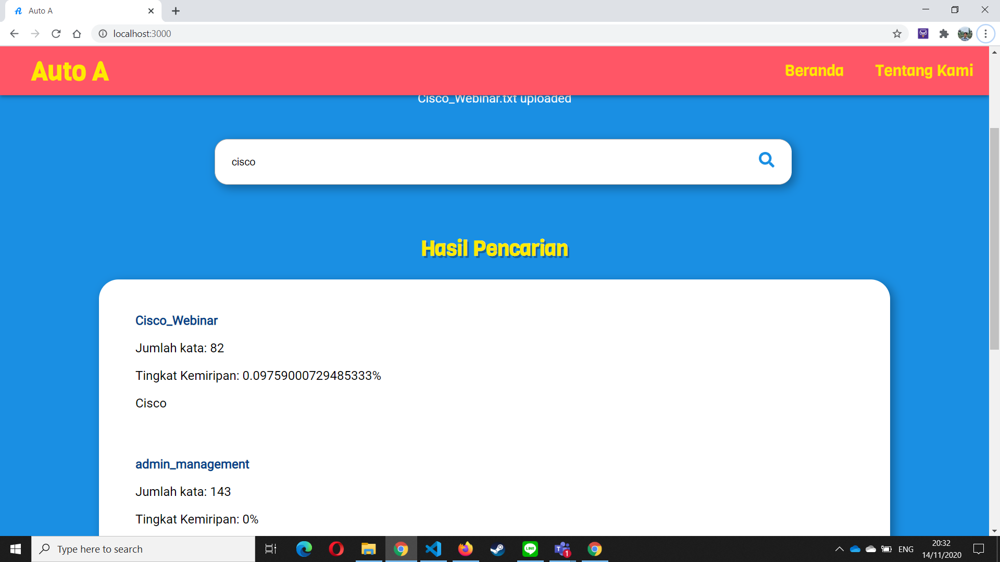

# Tugas Besar 2 Aljabar Linier dan Geometri
> Aplikasi Dot Product pada Sistem Temu-Balik Informasi

## Daftar Isi
* [Penjelasan](#penjelasan)
* [Screenshot](#screenshot)
* [Teknologi](#teknologi)
* [Setup](#setup)
* [Menjalankan Program](#menjalankan-program)
* [Kontributor](#kontributor)

## Penjelasan
Sebagaimana yang telah diajarkan di dalam kuliah pada materi vector di ruang Euclidean, temu-balik informasi (information retrieval) merupakan proses menemukan kembali (retrieval) informasi yang relevan terhadap kebutuhan pengguna dari suatu kumpulan informasi secara otomatis. Biasanya, sistem temu balik informasi ini digunakan untuk mencari informasi pada informasi yang tidak terstruktur, seperti laman web atau dokumen.
Untuk penjelasan lebih lanjut dapat dilihat [di sini](./doc/LAPORAN-APLIKASI-DOT-PRODUCT.pdf).

## Screenshot



## Teknologi
* Frontend : ReactJs
* Backend : Flask

Library yang digunakan:
* nltk
* Sastrawi
* pathlib
* numpy

## Setup
Untuk menggunakan proyek ini, diperlukan menginstall NPM untuk frontend dan virtual environment untuk install berbagai library yang digunakan di proyek ini.
### Instalasi NPM
Dari directory utama:
```bash
cd src
npm install
```
### Instalasi
Dari directory utama:
```bash
cd src/api
py -3 -m venv venv
source venv/Scripts/activate
pip install flask python-dotenv
pip install nltk Sastrawi pathlib numpy==1.19.3
```

## Menjalankan Program
### Frontend
Dari main directory lakukan ini:
```bash
cd src
npm start
```
### Backend
Dari main directory lakukan ini:
```bash
cd src/api
source venv/Scripts/activate
flask run
```
Catatan : Kedua proses di atas dilakukan di 2 terminal yang berbeda.
### Cara Penggunaan
Untuk melakukan pencarian diperlukan untuk meng-upload file-file yang diinginkan terlebih dahulu melalui uploader kami. Setelah semua upload selesai, fungsi pencarian proyek kami baru bisa digunakan. Hasil pencarian nanti akan ditampilkan di halaman beserta tabel kata. Selain itu, juga dapat mengakses dokumen dengan memencet link di hasil pencarian. Setiap dokumen juga dapat disimpan melalui tombol download file kami.

## Kontributor
1. Ferdy Irawan F.      (13519030)
2. Fakhri Nail W.       (13519035)
3. Fabian Savero D.P.   (13519140)
